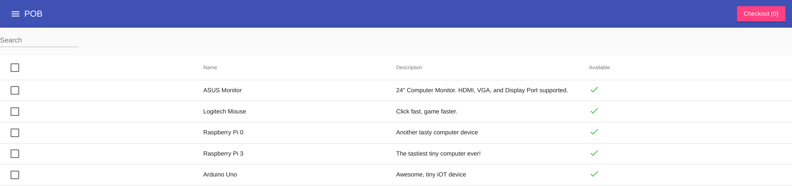
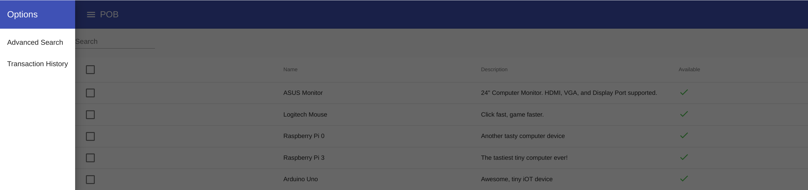
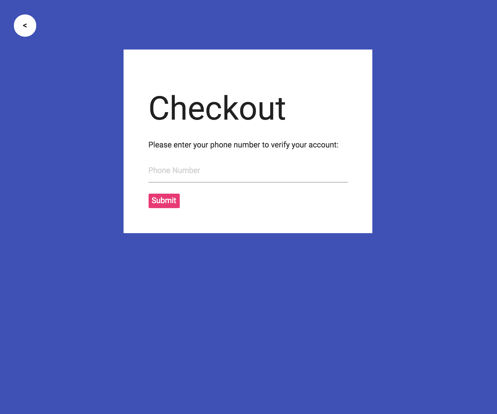
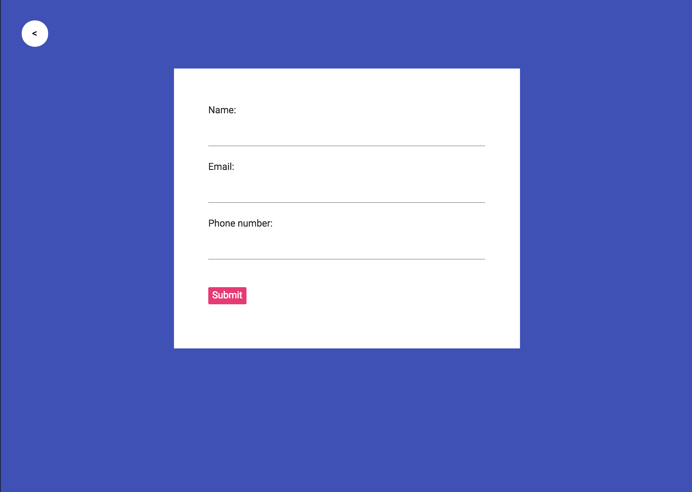

# POB HarperDB Hackathon App

Check out some cool pictures from our attempt at building a client:

This inventory table shows all items in the inventory

We started adding sorting features

And then when the customer was ready to borrow some items they were advanced to our checkout forms

Part of this Angulare 2 Client is functional (the table).
We didn't have enough time to complete the Checkout process but we gave it our best attempt in the time possible. Angular 2 was new to most of the team.

